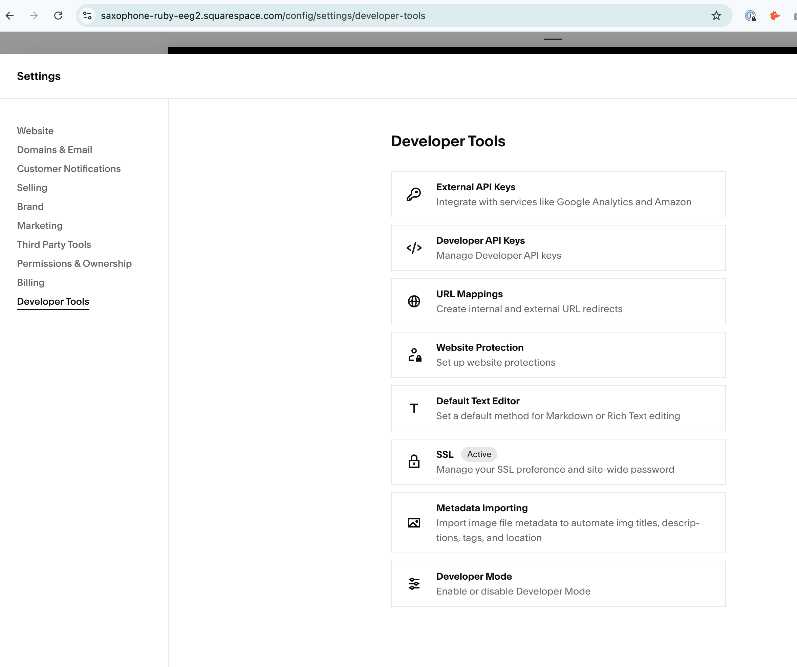
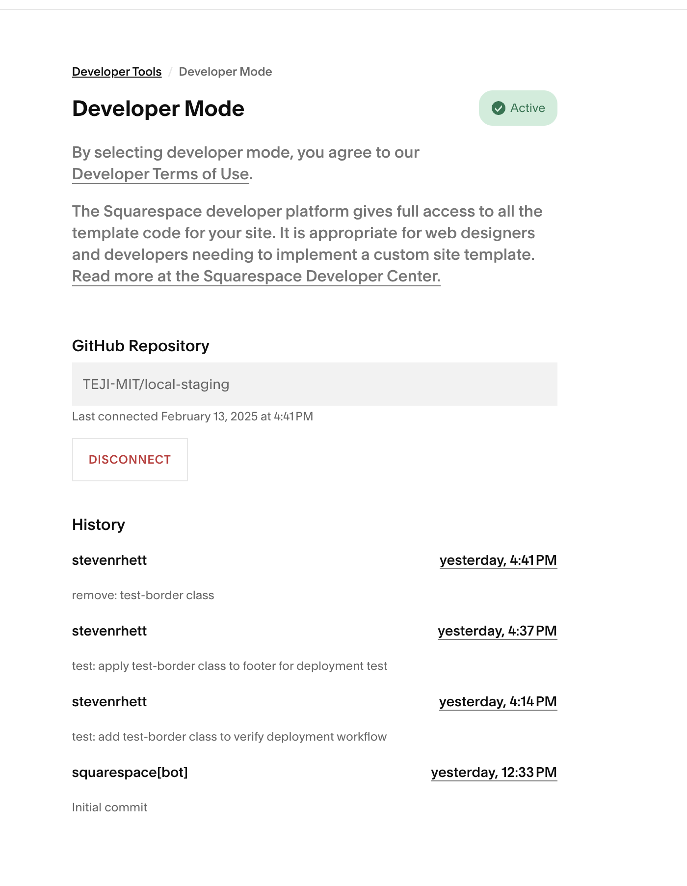
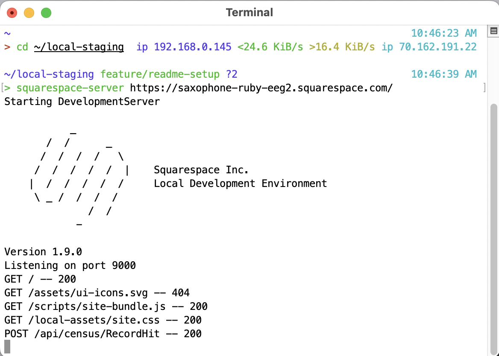

# TEJI Website - Squarespace Local Development Guide

TEJI Website is a Squarespace-based project that utilizes local development tools for custom template modifications. This guide provides comprehensive setup instructions and best practices for development.

## 🚀Quick Start

### Clone the repository
#### SSH
```bash
  git clone git@github.com:TEJI-MIT/local-staging.git 
  ```
#### OR
#### HTTPS
```bash
  git clone  https://github.com/TEJI-MIT/local-staging.git
```
### Install dependencies

```bash
  npm install
```
### Start local development server

```bash
  squarespace-server https://saxophone-ruby-eeg2.squarespace.com/ 
```
-----
## Table of Contents
- [Prerequisites](#prerequisites)
- [Installation](#installation)
- [Developer Mode Setup](#developer-mode-setup)
- [Local Development](#local-development)
- [GitHub Workflow](#github-workflow)
- [Troubleshooting](#troubleshooting)

## Prerequisites

Before beginning, ensure you have the following installed:
- Node.js (v16 or v18)
- NVM (Node Version Manager)
- Java 8 (Temurin 8 or Oracle JDK 1.8)
- Homebrew (macOS only)

## Installation

### 1. Node.js & NVM Setup

Install and configure Node.js using NVM:

```bash
  nvm install 18
  nvm use 18
```

### 2. Java 8 Installation

Install Java 8 using Homebrew:

```bash
  brew install --cask temurin@8
```

Verify Java installation:
```bash
  /usr/libexec/java_home -V
```

Set Java 8 as default:
```bash
  export JAVA_HOME=$(/usr/libexec/java_home -v 1.8)
  export PATH="$JAVA_HOME/bin:$PATH"
```

Add to ~/.zshrc for persistence:
```bash
  echo 'export JAVA_HOME=$(/usr/libexec/java_home -v 1.8)' >> ~/.zshrc
  echo 'export PATH="$JAVA_HOME/bin:$PATH"' >> ~/.zshrc
  source ~/.zshrc
```

### 3. Squarespace CLI Installation

```bash
  npm install -g --ignore-scripts @squarespace/server@1.7.0
```

## Developer Mode Setup

### Enabling Developer Mode

1. Navigate to Settings → Developer Tools in Squarespace dashboard
2. Enable Developer Mode
3. Connect your GitHub repository

Squarespace Developer Mode provides full access to all template files, allowing for advanced customization and version control.



Once Developer Mode is active, all template changes are tracked in GitHub. This allows:


### GitHub Integration

All template changes are automatically tracked in GitHub, providing:
- Version control
- Collaborative development capabilities
- Easy rollback options

## Local Development

Navigate to your project directory:
```bash
    cd ~/localstagingmaster
```
This is the output when running the Squarespace development server locally:


Start the development server:
```bash
    squarespace-server https://saxophone-ruby-eeg2.squarespace.com/                                      
```
After starting the server, open `http://localhost:9000/` in your browser:


## GitHub Workflow

### Branch Structure

- `main`: Production-ready code
- `staging`: Pre-production testing
- `feature/*`: Feature development
- `hotfix/*`: Urgent fixes

### Commit Guidelines

Use descriptive commit messages with the following prefixes:
- `feat:` New features
- `fix:` Bug fixes
- `style:` Styling changes
- `docs:` Documentation updates
- `refactor:` Code restructuring

Example:
```bash
    git commit -m "feat: add new navigation menu"
```

### Standard Workflow

1. Create feature branch:
```bash
    git checkout -b feature/your-feature staging
```

2. Make and commit changes:
```bash
    git add .
    git commit -m "feat: implement feature"
```

3. Push changes:
```bash
    git push origin feature/your-feature
```

4. Create PR to staging
5. Test on staging
6. Merge to main

## Troubleshooting

### Common Issues and Solutions

#### Squarespace CLI Not Found
```bash
    npx @squarespace/server auth
```

#### Missing Module Error
```bash
    npm uninstall -g @squarespace/server
    npm install -g --ignore-scripts @squarespace/server@1.7.0
```

#### Java Path Issues
```bash
    export JAVA_HOME=/Library/Java/JavaVirtualMachines/temurin8.jdk/Contents/Home
    export PATH="$JAVA_HOME/bin:$PATH"
```

## Maintainers

- [Steven Johnson](https://github.com/stevenrhett)
- Marisa Gaetz
- Helen Hamady

## Acknowledgments

- [Squarespace Development Team](https://github.com/Squarespace)
- [Brave Behind Bars Team](https://bravebehindbars.org/)
- Contributors to this guide

## License

This project is licensed under the MIT License - see the [LICENSE](LICENSE) file for details
